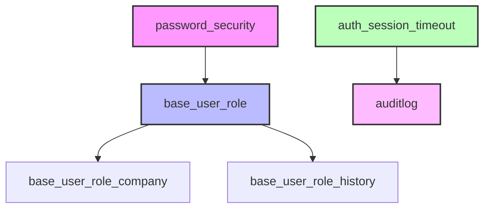

# Odoo ISO - Security and User Management Modules

[](https://github.com/focuz-ai/odoo-iso)
[](https://github.com/focuz-ai/odoo-iso)
[](https://www.odoo.com/)
[](http://www.gnu.org/licenses/agpl-3.0-standalone.html)
[](https://github.com/OCA)

## Description

This repository contains a collection of **Odoo 17 modules** focused on **security**, **user management**, and **ISO compliance**. These modules have been adapted and optimized to meet enterprise security standards and industry best practices.

The included modules provide advanced functionality for:

- 🔒 **Password security** with enterprise policies
- 📝 **Complete auditing** of system operations
- 👥 **Role management** with granular permissions
- ⏰ **Session control** with automatic timeout
- 🏢 **Company-based roles** for multi-company environments
- 📊 **Change history** for roles and permissions

## Available Modules

| Module | Version | Description | Status |
|--------|---------|-------------|---------|
| [auditlog](auditlog/) | 17.0.1.0.5 | Complete audit logging of CRUD operations | ✅ Production |
| [auth_session_timeout](auth_session_timeout/) | 17.0.1.0.1 | Automatic logout of inactive sessions | ✅ Stable |
| [base_user_role](base_user_role/) | 17.0.1.1.2 | Advanced user role system | ✅ Stable |
| [base_user_role_company](base_user_role_company/) | 17.0.1.1.1 | Company-specific roles | ⚠️ Beta |
| [base_user_role_history](base_user_role_history/) | 17.0.1.0.0 | History tracking for role changes | ⚠️ Beta |
| [password_security](password_security/) | 17.0.2.0.0 | Advanced password security policies | ✅ Stable |

## Key Features

### 🔐 **Enterprise Security**
- Configurable password policies (length, complexity, expiration)
- Password history to prevent reuse
- Automatic lock after failed login attempts
- Verification of compromised passwords

### 📋 **Auditing and Compliance**
- Detailed logging of all CRUD operations
- Tracking changes in specific fields
- HTTP access and session logs
- Compliance with ISO 27001 and SOX

### 👤 **Advanced User Management**
- Role-based system with inheritance
- Role assignment by date/time
- Company-specific roles
- Complete history of permission changes

### ⚡ **Session Control**
- Configurable inactivity timeout
- Automatic session closure
- Different parameters for internal and portal users
- Concurrent session management

## Installation

### Prerequisites
- Odoo 17.0 Community or Enterprise
- Python 3.8+
- PostgreSQL 12+

### Installation Steps

1. **Clone the repository:**
```bash
cd /path/to/odoo/addons
git clone https://github.com/focuz-ai/odoo-iso.git
```

2. **Update the addons path in odoo.conf:**
```ini
addons_path = /path/to/odoo/addons,/path/to/odoo-iso
```

3. **Restart the Odoo server:**
```bash
sudo systemctl restart odoo
```

4. **Update the application list:**
- Go to Applications > Update Apps List
- Search and install the desired modules

## Configuration

### Basic Configuration

#### Password Security
1. Go to **Settings > Users and Companies > Password Security**
2. Configure:
- Minimum password length
- Complexity requirements
- Expiration days
- Password history

#### Session Timeout
1. Go to **Settings > Technical > System Parameters**
2. Configure the parameters:
- `inactive_session_time_out_delay`: Time in seconds (default: 7200)
- `inactive_session_time_out_ignored_url`: Ignored URLs

#### Audit Log
1. Go to **Settings > Technical > Audit Rules**
2. Create rules for the models to audit
3. Configure specific fields to monitor
4. Set log retention period

### Advanced Configuration

#### User Roles
```python
# Example of programmatic role creation
role = self.env['res.users.role'].create({
    'name': 'Sales Supervisor',
    'group_ids': [(6, 0, [
        self.ref('sales_team.group_sale_manager'),
        self.ref('stock.group_stock_user'),
    ])],
    'company_id': self.env.company.id,
})

# Assign role to user
user.role_line_ids = [(0, 0, {
    'role_id': role.id,
    'date_from': fields.Date.today(),
    'date_to': fields.Date.today() + timedelta(days=365),
})]
```

## Use Cases

### 🏢 **Multinational Companies**
Management of roles differentiated by country/company with full auditing of changes.

### 🏥 **Healthcare Sector**
HIPAA compliance with detailed auditing and strict password policies.

### 🏦 **Financial Sector**
SOX compliance with full traceability and granular access control.

### 🏭 **Manufacturing**
Access control by plant/location with temporary roles for contractors.

## Architecture



## Testing

### Run Unit Tests
```bash
# All modules
python odoo-bin -c odoo.conf -d test_db --test-enable --stop-after-init -i auditlog,auth_session_timeout,base_user_role,base_user_role_company,base_user_role_history,password_security

# Specific module
python odoo-bin -c odoo.conf -d test_db --test-enable --stop-after-init -i password_security
```

### Test Coverage
```bash
coverage run --source='.' odoo-bin --test-enable
coverage report
coverage html
```

## Contribution

### How to Contribute?

1. Fork the project
2. Create a branch for your feature (`git checkout -b feature/AmazingFeature`)
3. Commit your changes (`git commit -m 'Add: Amazing Feature'`)
4. Push to the branch (`git push origin feature/AmazingFeature`)
5. Open a Pull Request

### Code Standards

- Follow [OCA Guidelines](https://github.com/OCA/odoo-community.org/blob/master/website/Contribution/CONTRIBUTING.rst)
- PEP 8 for Python code
- Documentation in Spanish and English
- Unit tests for new features
- Maintain test coverage > 80%

### Bug Reporting

Please report bugs using the [issues system](https://github.com/focuz-ai/odoo-iso/issues) including:

- Clear description of the problem
- Steps to reproduce
- Expected vs actual behavior
- Screenshots if applicable
- Odoo and module version

## Roadmap

### Q1 2025
- [ ] LDAP / Active Directory integration
- [ ] Two-factor authentication (2FA)
- [ ] Improved audit dashboard

### Q2 2025
- [ ] Support for Odoo 18
- [ ] Integration with external SIEM
- [ ] Role-based password policies

### Q3 2025
- [ ] Machine learning for anomaly detection
- [ ] Automated compliance reports
- [ ] REST API for role management

## Maintainers

### Main Maintainer
- **FOCUZ AI** - https://www.focuz.io  
  - Email: odoo@focuz.io  
  - GitHub: https://github.com/focuz-ai

### OCA Contributors
This project includes code from the following OCA contributors:

- ABF OSIELL
- ACSONE SA/NV
- LasLabs
- Tecnativa
- Open Source Integrators
- initOS GmbH
- Onestein

### Individual Contributors
- @sebalix
- @jcdrubay
- @novawish
- @dreispt
- @ThomasBinsfeld

## Support

### Commercial Support
For commercial support and customization contact:

- **Email:** odoo@focuz.io
- **Phone:** +51 948 609 939
- **Web:** https://www.focuz.io/odoo-support

### Community Support
- Odoo Forum
- OCA Mailing List
- Stack Overflow

## License

This project is licensed under:

- **AGPL-3** for most modules
- **LGPL-3** for `base_user_role` and `password_security`

See individual license files in each module for more details.

---

<p align="center">
  
</p>

<p align="center">
  <b>This is an OCA (Odoo Community Association) module</b><br/>
  <i>Mission: Promote the widespread use of Odoo by supporting collaborative development of features.</i>
</p>

---

**Last Updated:** December 2024  
**Odoo Version:** 17.0  
**Project Status:** Active 🟢